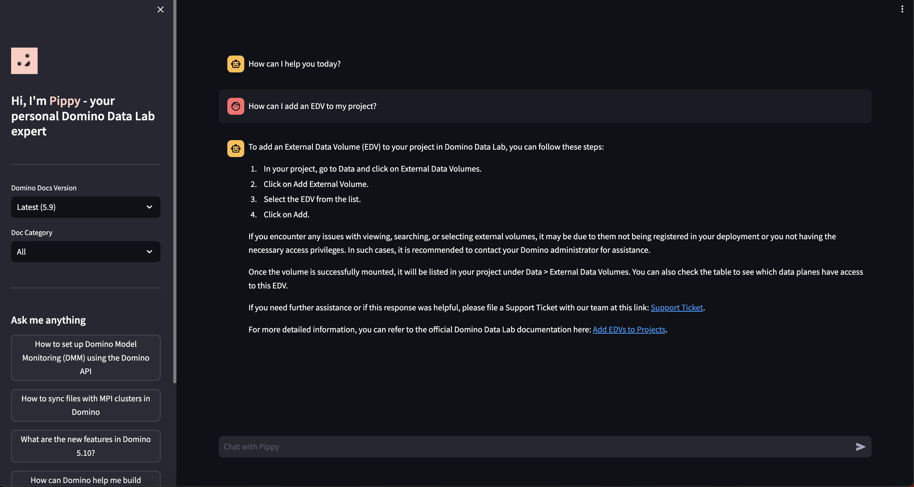

# Pippy Chatbot Template
Pippy is a Retrieval-Augmented Generation (RAG) Chatbot that utilizes a vector database with embeddings of articles from
[Domino documentation](https://docs.dominodatalab.com/) in combination with a Large Language Model (LLM) like ChatGPT.
This repository serves as a template based on Pippy to build your RAG chatbot off of, including logic to
to embed your texts and deploy the app.



## What's in here
### embed_gen
This folder contains `docs_embedder.ipynb`, which turns PDF documents into embeddings in a vector database such as Pinecone.
It also comes with sample files including the `pages.csv` metadata file and the `pdfs` folder.

The columns of the `pages.csv` are categories that form the metadata of an embedded text to filter a query by. 
For example, you can filter the chatbot to only search for relevant docs for Domino 5.8.0.
`pdfs` contain a sample PDF of an article that can be used to embed its text.  

### chatbot.py
This contains the main business logic of retrieving a user query, doing a search filtered by metadata in a vector database
for relevant context, and combining this context with ChatGPT for a relevant response.

### Other
* `app.sh` contains configuration logic for deploying the app for developing and production
* `ui` includes frontend logic for rendering the app's sidebar with a description and filtering options
* `assets` folder contains an image of Pippy!

## Set-up
### Datasets
You can create a [Dataset](https://docs.dominodatalab.com/en/latest/user_guide/0a8d11/create-and-modify-datasets/) in your Domino project
and with the data you want to use to create vector embeddings from (see sample PDFs and metadata file for examples). Datasets will
be automatically mounted when starting a [Domino Workspace](https://docs.dominodatalab.com/en/latest/user_guide/e6e601/launch-a-workspace/).
Then, reference it in `docs_embedder.ipynb` so that your chatbot can answer questions based on your data!

Alternatively, you can add your PDFs and metadata file directly into the project directory and reference them in your source code.

### Data Source
Set up a vector database with an index as a 
[Domino Data Source](https://docs.dominodatalab.com/en/latest/user_guide/fbb41f/data-source-connectors/) in your 
Domino deployment to store and retrieve embeddings. You can use any of the supported vector databases such as 
[Pinecone](https://docs.dominodatalab.com/en/latest/user_guide/5c64ef/connect-to-pinecone/) or
[Qdrant](https://docs.dominodatalab.com/en/latest/user_guide/c2364c/connect-to-qdrant/). 

Note: Use an index with dimension 1536 if using OpenAI (to match OpenAI's text-embedding-ada-002 model dimensions).

### AI Gateway
[Domino AI Gateway](https://docs.dominodatalab.com/en/latest/admin_guide/cce362/ai-gateway/) 
allows you to securely access external LLMs with access control and auditing. Create two AI Gateway endpoints for 
embeddings and chat. The embeddings endpoint allows you to access an embeddings model to create a vector embedding of 
a chunk of text while the chat endpoint allows you to query a chat model to generate responses based on the embeddings.

Call the
[Domino REST API to create an AI Gateway Endpoint](https://docs.dominodatalab.com/en/latest/api_guide/8c929e/rest-api-reference/#_createGatewayEndpoint) 
using the commands below. Feel free to experiment with different models and other configurations.

#### Create Endpoint to Embed Text
```bash
curl -d '{     
    "endpointName":"embeddings",
    "endpointType":"llm/v1/embeddings",
    "endpointPermissions":{"isEveryoneAllowed":true,"userIds":[]},
    "modelProvider":"openai",
    "modelName":"text-embedding-ada-002",
    "modelConfig":{"openai_api_key":"<OpenAI_API_Key>"}
}' -H "X-Domino-Api-Key:<Domino_API_Key>" -H "Content-Type: application/json" -X POST https://<Deployment_Base_Url>/api/aigateway/v1/endpoints
```
#### Create Endpoint to Call a Chatbot Model
```bash
curl -d '{
    "endpointName":"chat",
    "endpointType":"llm/v1/chat",
    "endpointPermissions":{"isEveryoneAllowed":true,"userIds":[]},
    "modelProvider":"openai",
    "modelName":"gpt-3.5-turbo",
    "modelConfig":{"openai_api_key":"<OpenAI_API_Key>"}
}' -H "X-Domino-Api-Key:<Domino_API_Key>" -H "Content-Type: application/json" -X POST https://<Deployment_Base_Url>/api/aigateway/v1/endpoints
```
Note: Please refer to [Domino AI Gateway](https://docs.dominodatalab.com/en/latest/admin_guide/cce362/ai-gateway/) docs
for the must up-to-date create endpoint commands.

### MLflow (Automatically Integrated)
We log the user queries, system prompt, conversation summary, search filters, and responses in the "Experiments" 
tab of your Domino project, which implements MLflow. The logic for this resides in `chatbot.py` and 
can be modified to suit your logging requirements. No additional steps are needed to use MLflow as it 
already comes with your Domino deployment.

To learn more about MLflow in Domino, check out our 
[article on tracking and monitoring](https://docs.dominodatalab.com/en/latest/user_guide/da707d/track-and-monitor-experiments/).

### Environment Requirements
The "Pippy RAG Chatbot Environment" is automatically created with this project template. This will be 
available in the "Environment" tab of your Domino project and accessible to your workspaces and jobs. You may reference
this environment if you want to build your own environment with the same dependencies.

### Hardware Requirements
This project works with a standard small-sized hardware tier, such as the small-k8s tier on all Domino deployments.

## Development in Domino Deployment
To develop and test your changes, create a workspace with the above environment definition.
Then:

1. Change ports in `app.sh` to any free port such as `8887` (the default `8888` is the port used 
when the app is published in Domino)
2. Run `./app.sh`
3. Go to `https://<domino-host-url>/<domino-username>/<domino-project-name>/notebookSession/<runId>/proxy/8887/`
where `runId` can be found in the URL of the workspace or as the environment variable `DOMINO_RUN_ID`.

Tip: You can use the following bash command in a Workspace terminal to obtain the URL:
```bash
echo -e "import os\nprint('https://<Deployment_Base_Url>/{}/{}/notebookSession/{}/proxy/8887/'.format(os.environ['DOMINO_STARTING_USERNAME'], os.environ['DOMINO_PROJECT_NAME'], os.environ['DOMINO_RUN_ID']))" | python3
```

## Deploying the App
1. Go to the "App" tab in you Domino project
2. Set the app title and any other configurations you wish to add such as a description and permissions
3. Click "Publish" to deploy the app in Domino!

See our article on [Publish an App](https://docs.dominodatalab.com/en/latest/user_guide/71635d/publish-apps/) 
for more detail on how to publish a variety of apps in Domino.